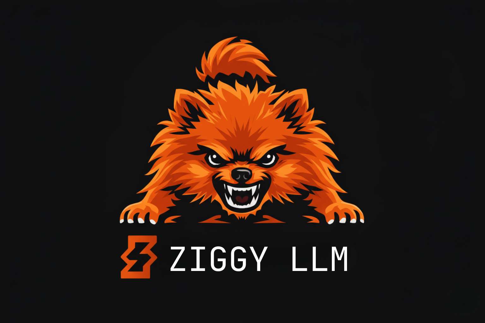

# ⚡️ ziggy-llm



Welcome to **ziggy-llm**, a Zig-native GGUF inference engine built specifically for Apple Silicon. If you're looking for an impossibly fast, understandable and deliberately narrow local AI runner, you're in the right place. 🚀

We don't try to do everything for everyone; instead, we do one thing exceptionally well. By focusing exclusively on Apple Metal and GGUF files, we deliver a single-binary, highly optimized CLI experience 💎

- Apple Silicon first
- Metal first
- GGUF only
- Single binary
- CLI first
- Tiny OpenAI-compatible server (coming soon!)

ziggy-llm is currently the fastest Zig GGUF inference engine on Apple Silicon.

## Blazing Fast Performance 🏎️

We benchmark honestly and optimize ruthlessly for single-user, local text generation on Macs. The following table compares end-to-end decode throughput on Apple Silicon (MacBook Pro M3 18GB) across ziggy-llm and llama.cpp using identical prompts and generation parameters. ZINC, another Zig GGUF inference engine (tested on M1 Max 32 GB, according to their docs) is also included for reference, although the prompt used is unknown. 📊

| Model              | GGUF   | ziggy-llm (Metal) | ZINC (Metal) | llama.cpp (Metal) |
| ------------------ | ------ | ----------------- | ------------ | ----------------- |
| **TinyLlama 1.1B** | Q4_K_M | ~123 tok/s        | —            | 151.4 tok/s       |
| **Llama 3.2 3B**   | Q4_K_M | ~48 tok/s         | —            | 53.5 tok/s        |
| **Llama 3.1 8B**   | Q4_K_M | ~22.4 tok/s       | ~10 tok/s    | 23.1 tok/s        |
| **Mistral 7B**     | Q4_K_M | ~20 tok/s         | —            | 28.0 tok/s        |
| **Ministral 3B**   | Q4_K_M | ~45.5 tok/s       | —            | 43.7 tok/s        |
| **Gemma 2 2B**     | Q4_K_M | ~48 tok/s         | —            | —                 |
| **Qwen3 1.7B**     | Q4_K_M | ~76 tok/s         | —            | 92.0 tok/s        |
| **Qwen3.8B**       | Q4_K_M | ~17.5 tok/s       | ~8 tok/s     | 25.0 tok/s        |
| **Qwen3.5 2B**     | Q4_K_M | ~48.9 tok/s       | —            | 62.4 tok/s        |

Note: ZINC's supported models are limited to the models listed in their documentation and the hardware they tested on (M1 Max 32 GB).

## Quick Start 🏁

Getting up and running takes just a few seconds. Ensure you have Zig 0.15.2 or newer installed, clone the repository, and build the release binary. 🛠️

Clone:

```bash
git clone https://github.com/Alex188dot/ziggy-llm.git
cd ziggy-llm
```

Build:

```bash
zig build -Doptimize=ReleaseFast
```

Chat:

```bash
./zig-out/bin/ziggy-llm chat \
  --model path/to/model.gguf \
  --backend metal \
  --temperature 0 \
  --seed 42
```

Run a single prompt:

```bash
./zig-out/bin/ziggy-llm run \
  --model path/to/model.gguf \
  --prompt "Write one short paragraph about Zig." \
  --backend metal \
  --max-tokens 128 \
  --temperature 0.7 \
  --seed 42
```

Benchmark:

```bash
./zig-out/bin/ziggy-llm bench \
  --model path/to/model.gguf \
  --prompt "Write one short paragraph about Zig." \
  --backend metal \
  --max-tokens 128 \
  --temperature 0.7 \
  --seed 42 \
  --bench-runs 5
```

With `--bench-runs N`, the first run is cold and the remaining runs use the resident runtime path.

Run tests:

```bash
zig build test
```

Update:

```bash
./zig-out/bin/ziggy-llm update
```

## Supported Models & Quants 🧠

Our goal is to support a deliberately narrow, highly-optimized matrix of popular models. Currently, we support the Qwen (2, 3, 3.5 dense), LLaMA (3.1, 3.2, TinyLlama), Mistral (and Ministral) and Gemma architectures (Gemma 2 and 3 for now, Gemma 4 coming soon). 🎯

For quantizations, we recommend our specialized MoonQuant targets: `Q4_K_M`, `Q6_K`, and `Q8_0`. We also fully support `F16` and `F32` formats as reference paths. 📉

Initial Qwen 3.5 MoE support is now available with a deliberately narrow boundary:

- runtime: CPU
- initial GGUF quant targets: `Q3_K`, `IQ3_XXS`, `IQ4_XS`
- Metal status: tensor preparation supports the initial Qwen 3.5 MoE quant targets, but end-to-end Qwen 3.5 MoE generation remains CPU-only
- unsupported for this initial slice: broader `IQ*` coverage beyond the listed formats and Qwen 3.5 MoE Metal generation

## CLI

Current commands:

```bash
zig build run
zig build run -- inspect -m /path/to/model.gguf
zig build run -- run -m /path/to/model.gguf -p "What is the meaning of life?" --max-tokens 8 --seed 7 --backend auto
zig build run -- run -m /path/to/model.gguf -p "What is the meaning of life?" --max-tokens 8 --seed 7 --backend metal
zig build run -- bench -m /path/to/model.gguf -p "What is the meaning of life?" --max-tokens 8 --seed 7 --backend metal
zig build run -- inspect -m models/Qwen3.5-35B-A3B-Q3_K_M.gguf
zig build run -- run -m models/Qwen3.5-35B-A3B-Q3_K_M.gguf -p "Hello" --max-tokens 16 --backend cpu
```

Right now, `inspect`, `run`, `chat` and `bench` are native Zig code. `serve` is still a scaffold command.

`--backend auto` is the default. On Apple Silicon builds with Metal enabled, the `llama` path will use Metal when it can initialize and fall back to CPU otherwise.

## Planned HTTP API 🔌

The server should stay small.

Initial target endpoints:

- `/health`
- `/v1/completions`
- `/v1/chat/completions`

The API exists to make testing and integration easy. It should not drag the project into becoming a giant orchestration platform.

## Join the Community 🤝

ziggy-llm is open source and in active development, and we would love your help to make it even better. Check out our issue tracker for things that need immediate attention: 🏗️

- [ ] Implement OpenAI compatible server
- [ ] Expand Qwen 3.5 MoE beyond the initial CPU-only `Q3_K` / `IQ3_XXS` / `IQ4_XS` support boundary and add Gemma 4
- [ ] Make chat more robust
- [ ] Test all quants (currently tested only Q4_K_M and Q6_K)
- [ ] Test bigger models (of Qwen 3 and Llama families) with higher end hardware, bigger context sizes and benchmark performance

If you find this project interesting, please consider starring the repo ⭐️. It genuinely helps us grow and reach more developers in the local AI ecosystem!

## License 📜

This project is licensed under the Apache-2.0 License. Feel free to use it, modify it, and build awesome native local AI tools with it. ⚖️
